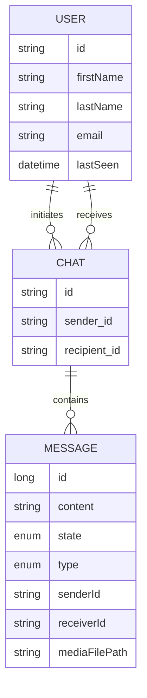

# Chat System (WhatsApp Clone) along with Entity Relationship Documentation
---

### 📽 Demo Video

[▶ Watch the demo](https://your-video-link.com)

---
## 📌 Tech Stack Overview

* **Spring Boot (Java)** - Backend Framework
* **PostgreSQL** - Relational Database
* **Spring Data JPA (Hibernate)** - ORM for database interaction
* **OAuth2 + Keycloak** - Authentication & JWT-based Authorization
* **WebSocket (STOMP)** - Real-time communication for messaging
* **Swagger (OpenAPI)** - API documentation
* **File Upload** - Supports attachments up to 50MB (image, video, etc.)

---

## 📌 Main Entities and Relationships

### 1. `User`

Represents a registered user in the system.

| Field     | Type            | Description                       |
| --------- | --------------- | --------------------------------- |
| id        | `String`        | UUID of the user                  |
| firstName | `String`        | First name of the user            |
| lastName  | `String`        | Last name of the user             |
| email     | `String`        | Email (also used for login)       |
| lastSeen  | `LocalDateTime` | Timestamp of user's last activity |

**Relationships:**

* `@OneToMany` chatsAsSender → List of chats where user is sender
* `@OneToMany` chatsAsRecipient → List of chats where user is recipient

---

### 2. `Chat`

Represents a chat session between two users.

| Field     | Type            | Description                     |
| --------- | --------------- | ------------------------------- |
| id        | `UUID`          | Unique ID of the chat           |
| sender    | `User`          | The user who initiated the chat |
| recipient | `User`          | The user receiving the chat     |
| messages  | `List<Message>` | All messages in this chat       |

**Relationships:**

* `@ManyToOne` sender → `User`
* `@ManyToOne` recipient → `User`
* `@OneToMany` messages → List of messages in this chat

**Business Logic:**

* Dynamically calculates chat name, unread count, last message, etc., using `@Transient` fields.

---

### 3. `Message`

Represents a single message sent in a chat.

| Field         | Type            | Description                           |
| ------------- | --------------- | ------------------------------------- |
| id            | `Long`          | Primary key with sequence generator   |
| content       | `String` (TEXT) | Actual message content                |
| state         | `MessageState`  | SENT, DELIVERED, SEEN                 |
| type          | `MessageType`   | TEXT, IMAGE, VIDEO, etc.              |
| chat          | `Chat`          | Chat this message belongs to          |
| senderId      | `String`        | ID of the sender                      |
| receiverId    | `String`        | ID of the receiver                    |
| mediaFilePath | `String`        | Path to uploaded file (if applicable) |

**Relationships:**

* `@ManyToOne` chat → The chat to which the message belongs

---

## 📌 ER Diagram (Mermaid Syntax for README)

---

## 📌 Key Business Rules

* A user can chat with any other user (bi-directional chats allowed)
* Messages are ordered by creation date
* Messages have a `state` to represent read/unread delivery status
* Chat UI features like showing unread count or last message preview are derived from `@Transient` fields
* File uploads supported through `mediaFilePath` for image/video/etc.

---
